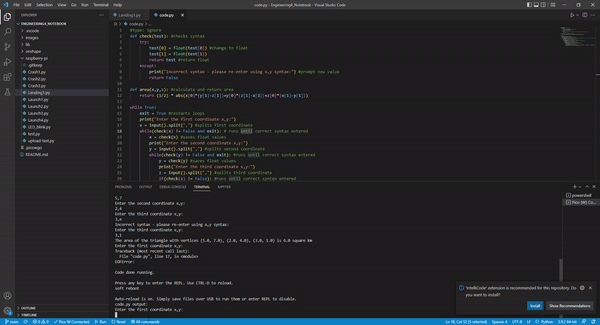
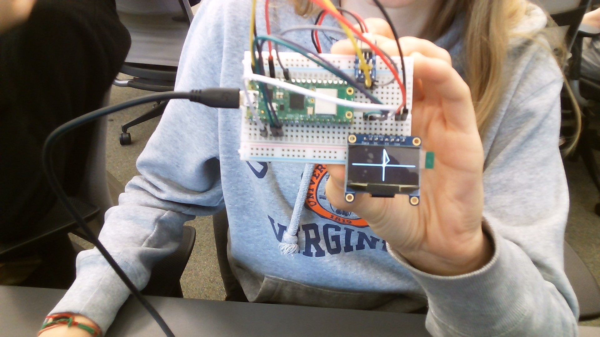
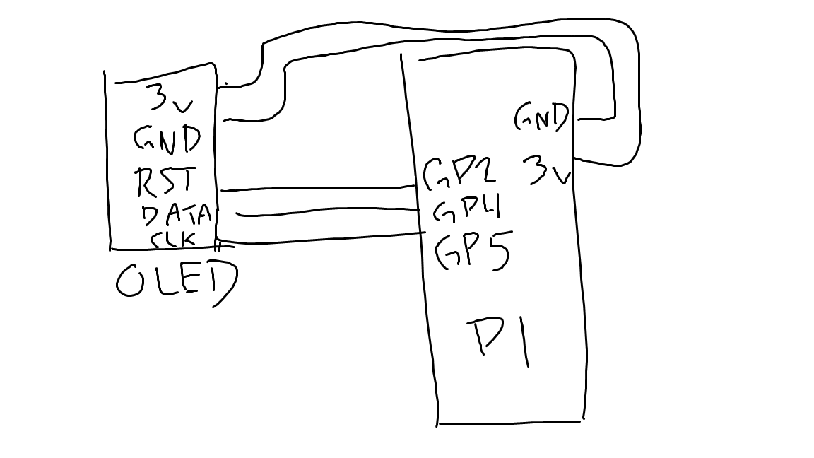
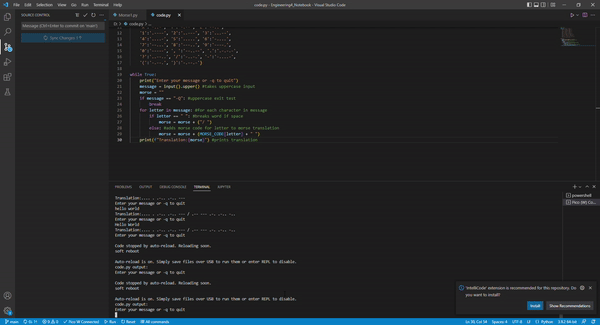
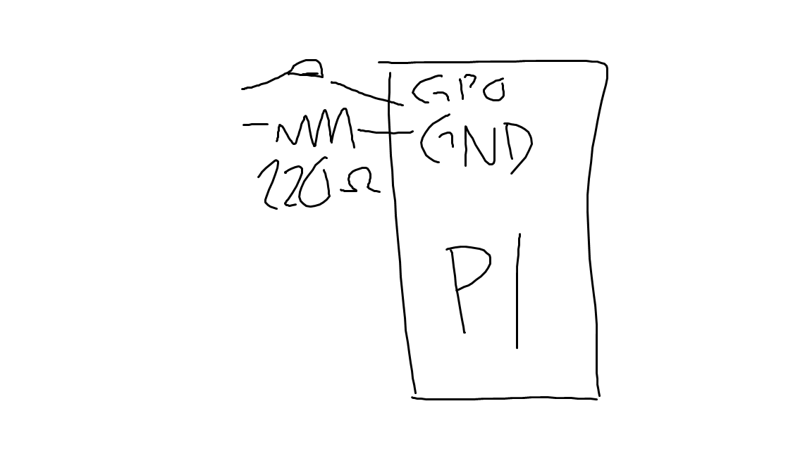
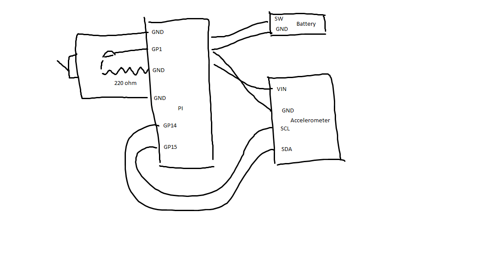
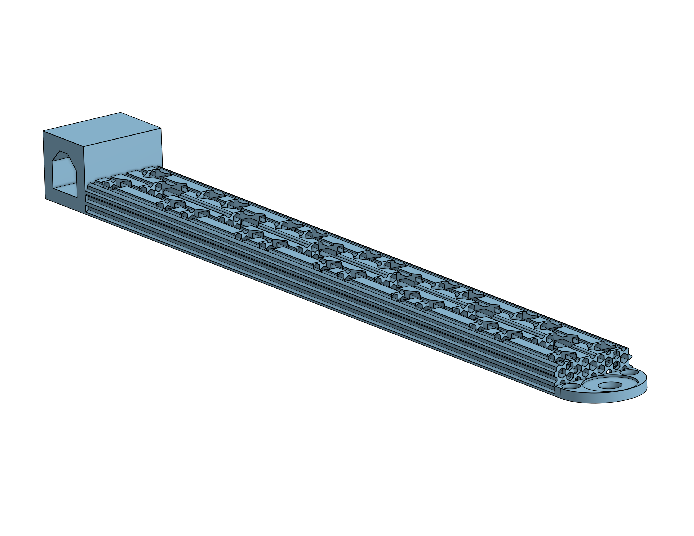
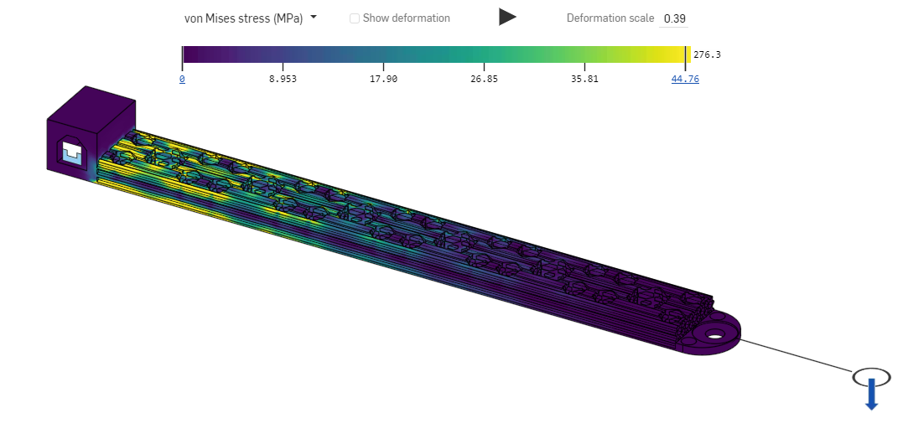
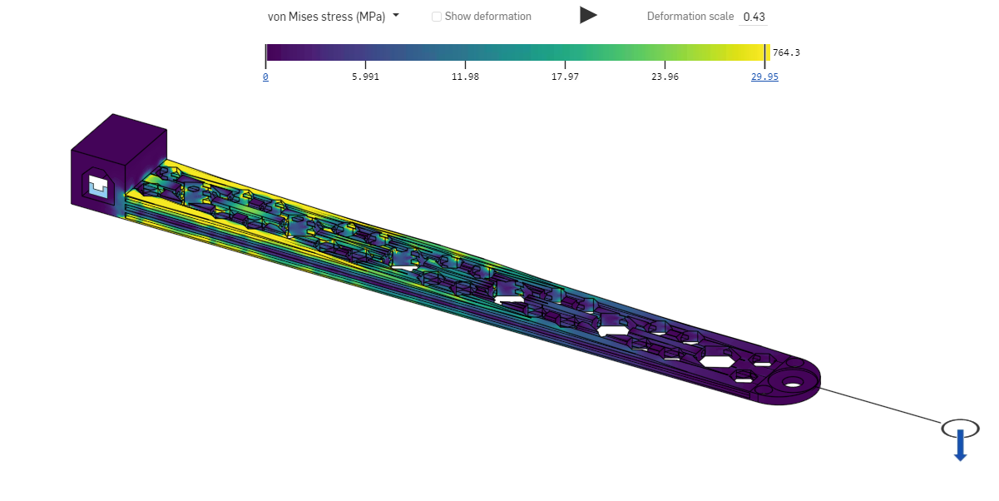

# Engineering_4_Notebook

&nbsp;

## Table of Contents
* [Launchpad 1](#launchpad_1)
* [Launchpad 2](#launchpad_2)
* [Launchpad 3](#launchpad_3)
* [Launchpad 4](#launchpad_4)
* [Crash Avoidance 1](#crash_avoidance_1)
* [Crash Avoidance 2](#crash_avoidance_2)
* [Crash Avoidance 3](#crash_avoidance_3)
* [Landing Area 1](#landing_area_1)
* [Landing Area 2](#landing_area_2)
* [Morse Code 1](#morse_code_1)
* [Morse Code 2](#morse_code_2)
* [Data Storage 1](#data_storage_1)
* [FEA Analysis 1](#fea_analysis_1)
* [FEA Analysis 3](#fea_analysis_3)
* [FEA Analysis 4](#fea_analysis_4)

&nbsp;

## Launchpad_1

This assignment counts down from 10 to 0.

### Code

[Launch 1 Code](https://github.com/honklin/Engineering4_Notebook/blob/main/raspberry-pi/Launch1.py)

### Evidence 

### Reflection

This assignment was pretty simple, but I did figure out that the syntax for 'for' statements is for var in range (limit inclusive, other limit exclusive, interval). I also figured out how to run the PICOs in the repl using Ctrl+D and Ctrl+S on the code.py file. The code.py file needs to be opened from the CircuitPy folder once the device is connected, not from a code.py file in the documents folder.

&nbsp;

## Launchpad_2

This assignment blinks a green LED every second as it counts down from 10 seconds, then turns the red LED on for liftoff.

### Code

[Launch 2 Code](https://github.com/honklin/Engineering4_Notebook/blob/main/raspberry-pi/Launch2.py)

### Evidence 

### Wiring

Launch 2 wiring

### Reflection

The only problems I had with this assignment was the wiring. I needed to check that my LEDs were working because the red one didn't turn on and was causing problems by turning the green LED on instead. Then, after I replaced the red LED, I discovered that the green LED wasn't turning on so I had to replace that as well.

&nbsp;

## Launchpad_3

This assignment uses a button to start the liftoff countdown from 10 with LEDs.

### Code

[Launch 3 Code](https://github.com/honklin/Engineering4_Notebook/blob/main/raspberry-pi/Launch3.py)

### Evidence 

### Wiring

Launch 3 Wiring

### Reflection

I added a pull down on the button in my code, but that means that I don't need a resistor on the button as well because the pull down declaration restricts the power it gives from the pin. I also ran into a problem where my button was always evaluating True even though I hadn't pressed it, but I realized that I had forgotten the button wires need to be on opposite sides and rails.

&nbsp;

## Launchpad_4

This assignment rotates a servo after the liftoff countdown ends.

### Code

[Launch 4 Code](https://github.com/honklin/Engineering4_Notebook/blob/main/raspberry-pi/Launch4.py)

### Evidence 

### Wiring

Launch 4 Wiring

### Reflection

I had some trouble getting my servo to turn even though my code was correct and I couldn't find any problems with my wiring. Then, I realized that I had accidentally wired my servo to ground through a resistor so the servo wasn't rotating. There was also a weird red triangle that popped up on VS code when I deleted lines, but it doesn't actually mean anything.

&nbsp;

## Crash_Avoidance_1

This assignment prints an accelerometers values to the serial monitor.

### Code

[Crash Avoidance 1 Code](https://github.com/honklin/Engineering4_Notebook/blob/main/raspberry-pi/Crash1.py)

### Evidence 

### Wiring

### Reflection

I did not think this assignment was very difficult. All I needed for the code was to declare the accelerometer and print its acceleration values to the serial monitor. The wiring wasn't difficult either because it was just the ground, 3V, SDA, and SCL pins.

&nbsp;

## Crash_Avoidance_2

This assignment turns on an LED when the board is tilted.

### Code

[Crash Avoidance 2 Code](https://github.com/honklin/Engineering4_Notebook/blob/main/raspberry-pi/Crash2.py)

### Evidence 

### Wiring

### Reflection

The most difficult part of this assignment was trying to separate the battery and the charger. I also had to be careful with the wiring so I didn't fry the PICO with the battery. In the code, I had to separate the accelerometer x, y, and z values like I would in an array so I could evaluate them separately.

&nbsp;

## Crash_Avoidance_3

This assignment prints the angular velocity on an OLED screen.

### Code

[Crash Avoidance 3 Code](https://github.com/honklin/Engineering4_Notebook/blob/main/raspberry-pi/Crash3.py)

### Evidence 

### Wiring

### Reflection

It was more challenging in this assignment to display output using the OLED and to connect 2 i2c devices on the same pins. I figured out how to connect both the OLED and accelerometer on the same SDA/SCL pins by distinguishing by the separate address on the two devices. I also figured out that unlike with an LED, you don't have to reposition the cursor for each line. You can use \n to move to a new line and \t to move the cursor a tab over to print the text.

&nbsp;

## Landing_Area_1

This assignment lets the user enter 3 coordinates as input and calculates the area made between the coordinates.

### Code

[Landing Area 1 Code](https://github.com/honklin/Engineering4_Notebook/blob/main/raspberry-pi/Landing1.py)

### Evidence 

### Reflection

This assignment was challenging because I had to learn how to take inputs from the terminal using the input() function. I also had to figure out how to split the coordinates entered into 2 separate numbers using the split() function that the function could use to calculate the area. I used a try/except test to make sure the user input the coordinates in the right form and would prompt the user to correct their format if the syntax was incorrect.

&nbsp;

## Landing_Area_2

This assignment lets the user enter 3 coordinates as input, calculates the area made between the coordinates, and draws the triangle on an OLED.

### Code

[Landing Area 2 Code](https://github.com/honklin/Engineering4_Notebook/blob/main/raspberry-pi/Landing2.py)

### Evidence 

### Wiring

### Reflection

This assignment was not too challenging because it just added one function onto Landing Area 1. I just needed to add the graphing function that drew the axes, the origin, and the triangle. The hardest part was offsetting the coordinates so that the triangle was drawn from the origin and not from the upper left corner of the OLED.

&nbsp;

## Morse_Code_1

This assignment takes a message from the user and outputs the morse code translation.

### Code

[Morse Code 1 Code](https://github.com/honklin/Engineering4_Notebook/blob/main/raspberry-pi/Morse1.py)

### Evidence 

### Reflection

This assignment used a dictionary to translate from the English letters to the morse code equivalent. A dictionary stores a value to the letters so that when a letter is called, it returns the equivalent morse code translation. Then I figured out that Python will combine strings together if they are added with the "+" sign.

&nbsp;

## Morse_Code_2

This assignment takes a message from the user, outputs the morse code translation, and then blinks the morse code on an LED.

### Code

[Morse Code 2 Code](https://github.com/honklin/Engineering4_Notebook/blob/main/raspberry-pi/Morse2.py)

### Evidence 

### Wiring

### Reflection

This assignment was not very challenging because it was very similar to part 1. I only had to add one for loop to make the LED blink in the correct morse code. The loop checks which character is next in the morse code string and turns the LED on or off and delays depending on the character.

&nbsp;

## Data_Storage_1

This assignment takes data from an accelerometer and saves the data to a file once reconnected to the terminal.

### Code

[Data Storage 1 Code](https://github.com/honklin/Engineering4_Notebook/blob/main/raspberry-pi/Data1.py)

### Evidence 

### Wiring

### Reflection

This assignment used the tilt sensing from Crash Avoidance 3 and added the data saving. To run the code correctly, first switch the board from code mode to data mode, then disconnect the board and turn on the battery and collect the data, then switch the board back into code mode, and lastly turn off the battery and reconnect to the terminal. I had some trouble uploading the data to the data.csv file, but I realized I had to use datalog.flush() to upload the data.

&nbsp;

## FEA_Analysis_1

### Assignment Description

In this assignment we designed a beam that we thought would best hold as much weight as possible without breaking or bending too far.

### Part Link 

[Beam](https://cvilleschools.onshape.com/documents/9038cb34a59f90ef5226b7fe/w/995d5394430dd0e4e411f47a/e/81684d3986b9792771074cb9?renderMode=0&uiState=651d6972c9903a610100dd2c)

### Part Image

### Reflection

We thought that a honeycomb pattern would work best to support the beam. We cut out hexagons along the center of the beam but found that the beam was still much too heavy. We needed to cut 8 grams off the weight to get it under 13 grams for the assignment so we cut hexagons from the top to the bottom of the beam. We also filletted points and cut off any excess material to reduce the weight and finally got it to 12.99 grams. Because we had to cut holes in the beam to make the weight requirement, there is a chance that the beam will break easily.

&nbsp;

## FEA_Analysis_3

### Assignment Description

In this assignment we ran a simulation to see the effects of a force on our beam.

### Part Link 

[Beam](https://cvilleschools.onshape.com/documents/9038cb34a59f90ef5226b7fe/w/995d5394430dd0e4e411f47a/e/81684d3986b9792771074cb9?renderMode=0&uiState=651d6972c9903a610100dd2c)

### Part Image

### Reflection

Our simulation showed that the beam was under the most stress nearest to the holder and was under less stress at the end of the beam. The beam seems to bend quite a bit so we will need to find a way to reinforce it. We are planning to move the material from the parts under less force to areas under more force by slanting the top of beam so that it is thicker nearer to beginning of the beam and thinner at the end.

&nbsp;

## FEA_Analysis_4

### Assignment Description

In this assignment we used the data from our simulation to make our beam stronger.

### Part Link 

[Beam](https://cvilleschools.onshape.com/documents/9038cb34a59f90ef5226b7fe/w/995d5394430dd0e4e411f47a/e/81684d3986b9792771074cb9?renderMode=0&uiState=651d6972c9903a610100dd2c)

### Part Image

### Reflection

Our simulation showed that our beam was under a lot of stress near the holder and wasn't under much stress nearer to the end. We decided to slant the top so that the beam was thicker near the holder, where it was under more stress, and made it thinner at the end of the beam. We hoped that this would strengthen the parts under more stress by weakening the parts under lower stress. The parts nearer to the beam would bend more because of how the force is applied, but by making it thicker, the beam should be able to beand farther without breaking.

&nbsp;

## Media Test

### Test Link
[Link](http://www.google.com)

### Test Image

### Test GIF

