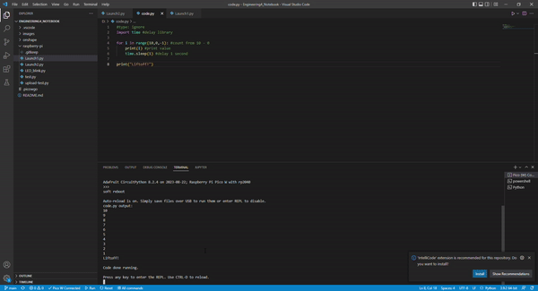
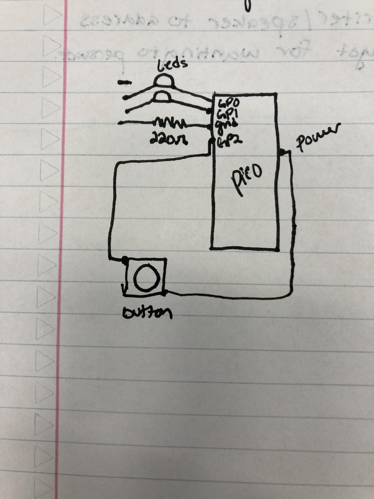
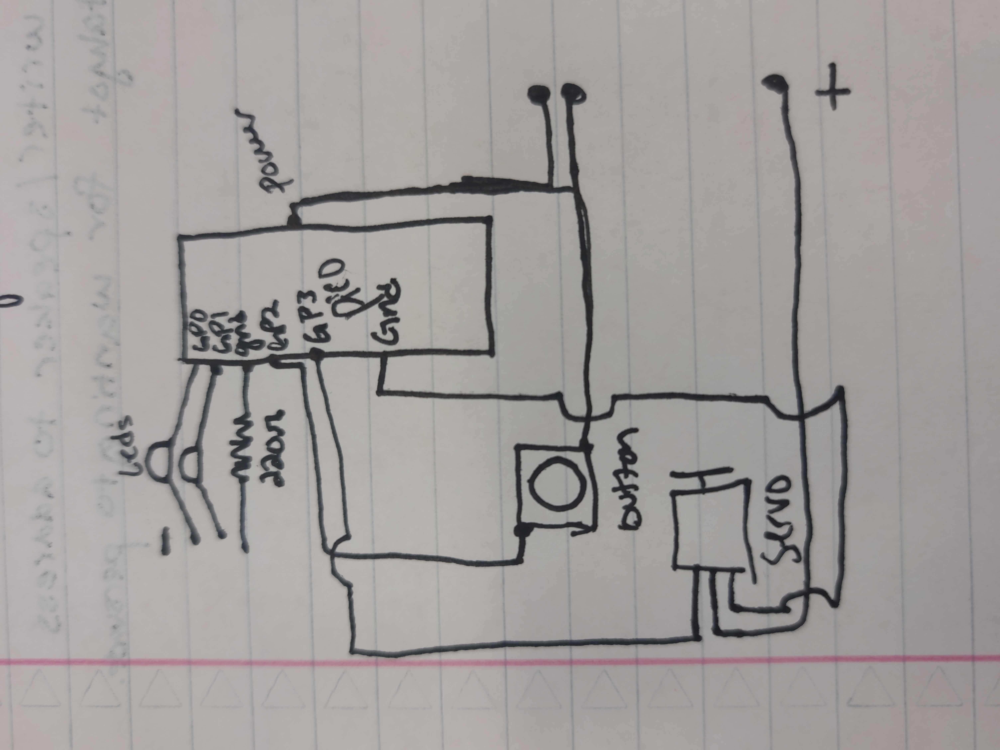
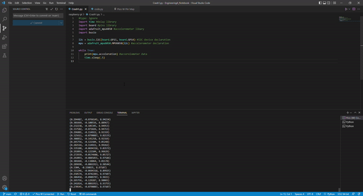
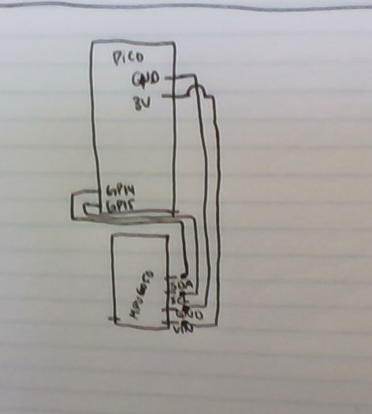
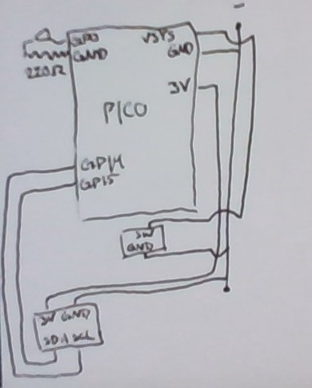
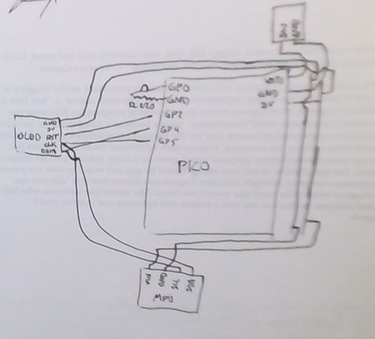
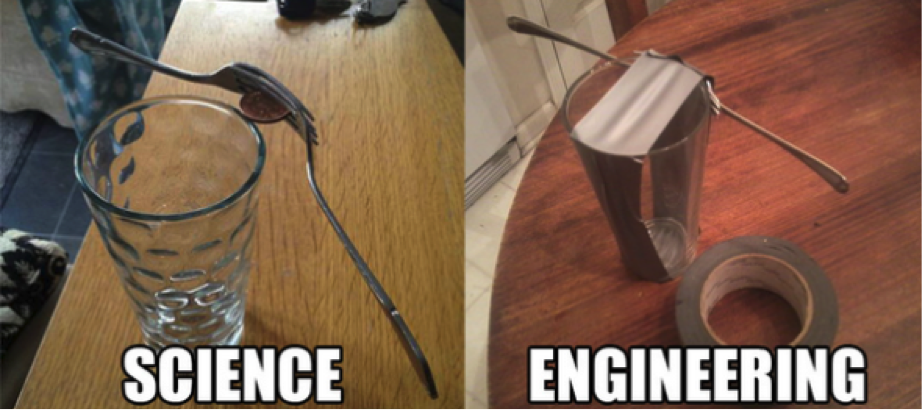

# Engineering_4_Notebook

&nbsp;

## Table of Contents
* [Launchpad 1](#launchpad_1)
* [Launchpad 2](#launchpad_2)
* [Launchpad 3](#launchpad_3)
* [Launchpad 4](#launchpad_4)
* [Crash Avoidance 1](#crash_avoidance_1)
* [Crash Avoidance 2](#crash_avoidance_2)
* [Crash Avoidance 3](#crash_avoidance_3)
* [Onshape_Assignment_Template](#onshape_assignment_template)

&nbsp;

## Launchpad_1

This assignment counts down from 10 to 0.

### Code

[Launch 1 Code](https://github.com/honklin/Engineering4_Notebook/blob/main/raspberry-pi/Launch1.py)

### Evidence 

### Reflection

This assignment was pretty simple, but I did figure out that the syntax for 'for' statements is for var in range (limit inclusive, other limit exclusive, interval). I also figured out how to run the PICOs in the repl using Ctrl+D and Ctrl+S on the code.py file. The code.py file needs to be opened from the CircuitPy folder once the device is connected, not from a code.py file in the documents folder.

&nbsp;

## Launchpad_2

This assignment blinks a green LED every second as it counts down from 10 seconds, then turns the red LED on for liftoff.

### Code

[Launch 2 Code](https://github.com/honklin/Engineering4_Notebook/blob/main/raspberry-pi/Launch2.py)

### Evidence 

### Wiring

Launch 2 wiring

### Reflection

The only problems I had with this assignment was the wiring. I needed to check that my LEDs were working because the red one didn't turn on and was causing problems by turning the green LED on instead. Then, after I replaced the red LED, I discovered that the green LED wasn't turning on so I had to replace that as well.

&nbsp;

## Launchpad_3

This assignment uses a button to start the liftoff countdown from 10 with LEDs.

### Code

[Launch 3 Code](https://github.com/honklin/Engineering4_Notebook/blob/main/raspberry-pi/Launch3.py)

### Evidence 

### Wiring

Launch 3 Wiring

### Reflection

I added a pull down on the button in my code, but that means that I don't need a resistor on the button as well because the pull down declaration restricts the power it gives from the pin. I also ran into a problem where my button was always evaluating True even though I hadn't pressed it, but I realized that I had forgotten the button wires need to be on opposite sides and rails.

&nbsp;

## Launchpad_4

This assignment rotates a servo after the liftoff countdown ends.

### Code

[Launch 4 Code](https://github.com/honklin/Engineering4_Notebook/blob/main/raspberry-pi/Launch4.py)

### Evidence 

### Wiring

Launch 4 Wiring

### Reflection

I had some trouble getting my servo to turn even though my code was correct and I couldn't find any problems with my wiring. Then, I realized that I had accidentally wired my servo to ground through a resistor so the servo wasn't rotating. There was also a weird red triangle that popped up on VS code when I deleted lines, but it doesn't actually mean anything.

&nbsp;

## Crash_Avoidance_1

This assignment prints an accelerometers values to the serial monitor.

### Code

[Crash Avoidance 1 Code](https://github.com/honklin/Engineering4_Notebook/blob/main/raspberry-pi/Crash1.py)

### Evidence 

### Wiring

### Reflection

I did not think this assignment was very difficult. All I needed for the code was to declare the accelerometer and print its acceleration values to the serial monitor. The wiring wasn't difficult either because it was just the ground, 3V, SDA, and SCL pins.

&nbsp;

## Crash_Avoidance_2

This assignment turns on an LED when the board is tilted.

### Code

[Crash Avoidance 2 Code](https://github.com/honklin/Engineering4_Notebook/blob/main/raspberry-pi/Crash2.py)

### Evidence 

### Wiring

### Reflection

The most difficult part of this assignment was trying to separate the battery and the charger. I also had to be careful with the wiring so I didn't fry the PICO with the battery. In the code, I had to separate the accelerometer x, y, and z values like I would in an array so I could evaluate them separately.

&nbsp;

## Crash_Avoidance_3

This assignment prints the angular velocity on an OLED screen.

### Code

[Crash Avoidance 3 Code](https://github.com/honklin/Engineering4_Notebook/blob/main/raspberry-pi/Crash3.py)

### Evidence 

### Wiring

### Reflection

It was more challenging in this assignment to display output using the OLED and to connect 2 i2c devices on the same pins. I figured out how to connect both the OLED and accelerometer on the same SDA/SCL pins by distinguishing by the separate address on the two devices. I also figured out that unlike with an LED, you don't have to reposition the cursor for each line. You can use \n to move to a new line and \t to move the cursor a tab over to print the text.

&nbsp;

## Onshape_Assignment_Template

### Assignment Description

Write your assignment description here. What is the purpose of this assignment? It should be at least a few sentences.

### Part Link 

[Create a link to your Onshape document](https://cvilleschools.onshape.com/documents/003e413cee57f7ccccaa15c2/w/ea71050bb283bf3bf088c96c/e/c85ae532263d3b551e1795d0?renderMode=0&uiState=62d9b9d7883c4f335ec42021). Don't forget to turn on link sharing in your Onshape document so that others can see it. 

### Part Image

Take a nice screenshot of your Onshape document. 

### Reflection

What went wrong / was challenging, how'd you figure it out, and what did you learn from that experience? Your goal for the reflection is to pass on knowledge that will make this assignment better or easier for the next person. Think about your audience for this one, which may be "future you" (when you realize you need some of this code in three months), me, or your college admission committee!

&nbsp;

## Media Test

Your readme will have various images and gifs on it. Upload a test image and test gif to make sure you've got the process figured out. Pick whatever image and gif you want!

### Test Link
[Link](http://www.google.com)

### Test Image

### Test GIF

